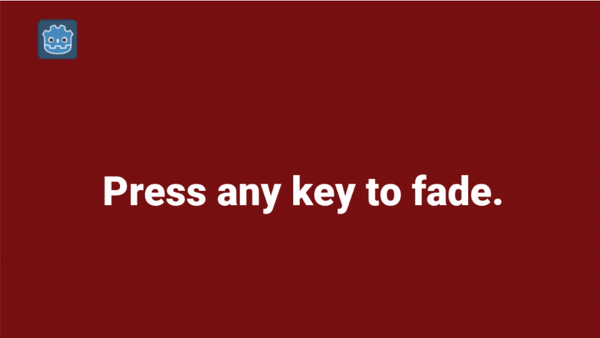
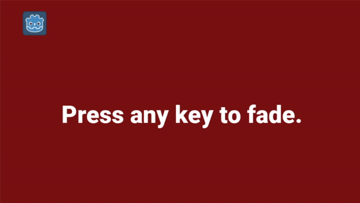
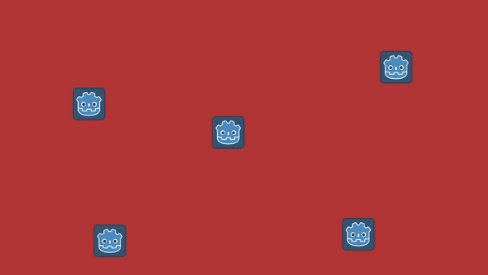
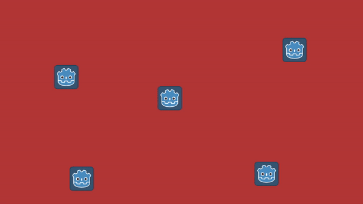

# Fancy Fades for Godot

Fancy shader effects to cross-fade between two scenes in Godot 4.x. If you're using Godot 3.x, check out the `godot-3.x` branch.

- Fade with just one line of code
- Ships with several sample transition images
- Easily customizable with a simple black-and-white image
- You can transition to an instance of a scene (e.g. after calling setup/initialize methods on it)

# Usage

- Add `addons/transitions/Transitions.gd` and `addons/transitions/FancyFade.gd` as autoload singleton scripts to your project (in that order)
- Call the appropriate `FancyFade` method with parameters (e.g. `FancyFade.wipe_left(InventoryScene.instance())`)

# Fades

I recently added several fades to the library (and plan to add several more). Since it's tedious to maintain a list here, you can find the full list in the `FancyFade` method. Apologies if this list is out of date.

## Noise

Blend uses a transition with a noisy texture.(The texture is not generated, so the fade is the same every time.)

- `FancyFade.noise`: noise (1-pixel size)
- `FancyFade.pixelated_noise`: pixelated noise (32-pixel size)
- `FancyFade.blurry_noise`: blurry noise (see below)
- `FancyFade.cell_noise`: cellular-shaped noise



## Wipes

Simple, linear gradients in a variety of shapes.

- `FancyFade.wipe_left`: wipe from right to left
- `FancyFade.wipe_right`: wipe from left to right
- `FancyFade.wipe_up`: wipe from bottom to top
- `FancyFade.wipe_down`: wipe from top to bottom
- `FancyFade.wipe_square`: a square-shaped fade from center to the edges of the screen
- `FancyFade.wipe_conical`: a clockwise fade starting from the top-left (see below)

Conical:



## Circular Fades

Fade the screen in the shape of a circle/ellipse.

- `FancyFade.circle_in`: Fades the new scene in as a circle that grows from the center of the screen.
- `FancyFade.circle_out`: Fades the new scene in from a circle that "shrinks in" from the edges of the screen.

## Other Fades

- `FancyFade.horizontal_paint_brush`: Fades using four paint-like brush strokes, horizontally across the screen, from top to bottom (see below)
- `FancyFade.vertical_paint_brush`: Fades using four paint-like brush strokes, vertically across the screen, from left to right
- `FancyFade.swirl`: A swirly swishy fade (see below)
- `FancyFade.tile_reveal`: Reveals the scene using diagonal tiles, from top-left to bottom-right (see below)

Horizontal paint brush:



Swirl:


Tile reveal:



## CrossFade

Fades one screen directly into another.

Code:

```gdscript
Transitions.change_scene(ManualTest1.instance(), Transitions.FadeType.CrossFade, 1)
```


## Custom Fade

Transitions between two scenes, using a black-and-white image as a mask. As time goes by, the pixels become transparent and show the underlying scene, starting from black first. All of the other methods use this with a specific texture. For example images, see `addons/transitions/images`.

Code:

```gdscript
const DISSOLVE_IMAGE = preload('res://addons/transitions/images/blurry-noise.png')
FancyFade.custom_fade(ManualTest2.instance(), 1.5, DISSOLVE_IMAGE)
```

Custom fade uses a transition with a noisy texture:


You can check any of the pre-existing images in `addons/transitions/images` for samples.

# Credits

- [Horizontal Paint Brush Wipe](https://store.kde.org/p/1675120) image by Kdenlive Lumas, via KDE Store
- [Tile Reval](https://raw.githubusercontent.com/mightymochi/Godot-3-Masking-Methods/main/Assets/tile_reveal.png) image by [Mighty Mochi](https://github.com/mightymochi)
